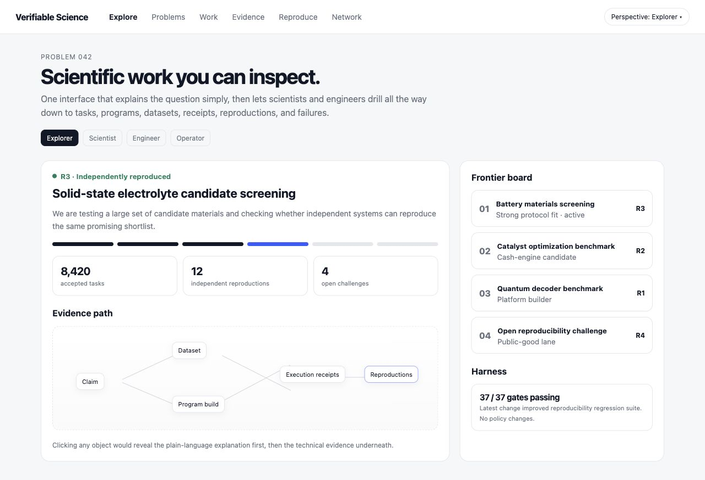
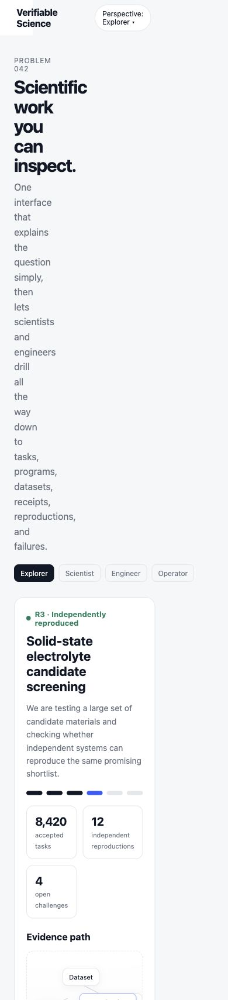

# Existing Prototype UX Audit

Audit date: 2026-08-10

Surface: `web/ui-prototype.html`

Task assessed: understand a scientific result, switch perspective, and identify supporting/challenging evidence on desktop and mobile.

## Step 1 — Desktop evidence overview: promising concept, not yet trustworthy

Strengths:

- The question, evidence state, reproductions, and challenges are visible together.
- Progressive disclosure and perspective switching are strong organizing ideas.
- The evidence-path visualization makes provenance approachable.

Issues:

- Navigation, perspective choices, cards, and evidence nodes are generic non-interactive elements; the promised drill-down cannot be completed.
- `8,420`, `12`, `4`, and `37 / 37` appear operationally real without a `DEMO / SYNTHETIC` label or provenance.
- The UI specification includes Challenges and Security, but the prototype navigation/perspective switcher omits them.
- `R3` has no visible definition, criteria, date, policy version, or limitations.

Accessibility risks visible from the DOM/screenshot:

- Controls are not semantic links, buttons, tabs, or a labeled select.
- The graph communicates relationships visually without an equivalent ordered text path.
- Status meaning relies partly on color.

## Step 2 — Counterparty onboarding: absent

There is no route for a sponsor, scientist, worker, verifier, reproducer, data owner, institutional security reviewer, or auditor to reach a first useful outcome. The page describes the destination but not how a participant safely joins it.

Required direction:

- role/outcome selection;
- classification and permission preview;
- synthetic dry run;
- first receipt/review;
- scoped activation and clear revocation.

## Step 3 — Mobile evidence overview: unhealthy

The narrow viewport forces headline and body content into a thin column, produces excessive vertical scanning, hides the main navigation, and makes the evidence graph difficult to understand. Mobile is not ready for onboarding or evidence review.

## Highest-impact changes

1. Label all demonstration data and link it to a fixture/generator.
2. Replace generic controls with semantic, keyboard-operable navigation, tabs, buttons, and evidence links.
3. Add a role-specific onboarding entry that ends in a synthetic first success.
4. Put supporting evidence and the Counterexample Track side by side.
5. Define evidence states in context with policy version, recency, and limitations.
6. Redesign the small-screen information hierarchy before building new visual polish.

## Evidence limits

This was a screenshot and DOM audit of one static prototype. It did not test authenticated flows, real data, screen-reader announcements, focus order, contrast ratios, latency, errors, or recovery because those experiences do not yet exist.
